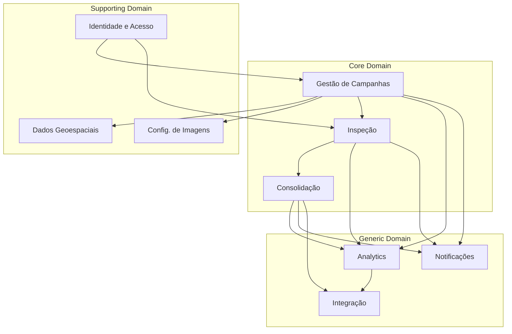
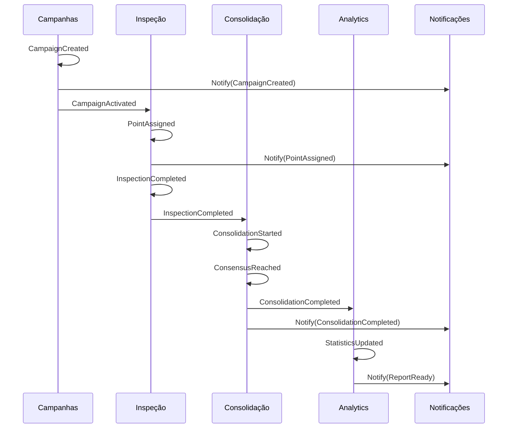

# TVI - Modelo de Domínios e Contextos Delimitados

## Índice

1. [Visão Geral dos Domínios](#visão-geral-dos-domínios)
2. [Domínio de Identidade e Acesso](#domínio-de-identidade-e-acesso)
3. [Domínio de Gestão de Campanhas](#domínio-de-gestão-de-campanhas)
4. [Domínio de Configuração de Imagens](#domínio-de-configuração-de-imagens)
5. [Domínio de Dados Geoespaciais](#domínio-de-dados-geoespaciais)
6. [Domínio de Inspeção](#domínio-de-inspeção)
7. [Domínio de Consolidação](#domínio-de-consolidação)
8. [Domínio de Analytics e Relatórios](#domínio-de-analytics-e-relatórios)
9. [Domínio de Notificações](#domínio-de-notificações)
10. [Domínio de Integração](#domínio-de-integração)
11. [Mapa de Contextos](#mapa-de-contextos)
12. [Eventos de Domínio](#eventos-de-domínio)

---

## Visão Geral dos Domínios

O sistema TVI é dividido em 9 domínios principais, cada um responsável por um conjunto específico de capacidades de negócio. Esta separação segue os princípios de Domain-Driven Design (DDD) para criar limites claros entre diferentes áreas do sistema.

### Princípios de Separação:
- **Coesão**: Cada domínio agrupa funcionalidades relacionadas
- **Baixo acoplamento**: Domínios se comunicam através de contratos bem definidos
- **Linguagem ubíqua**: Cada domínio mantém seu próprio vocabulário
- **Autonomia**: Domínios podem evoluir independentemente

---

## Domínio de Identidade e Acesso

### Responsabilidades
- Autenticação de usuários via SSO Keycloak
- Autorização e controle de permissões
- Gestão de perfis de usuário
- Controle de sessões

### Entidades Principais

#### User
```typescript
interface User {
  id: string;
  keycloakId: string;
  email: string;
  name: string;
  avatar?: string;
  role: UserRole;
  preferences: UserPreferences;
  createdAt: Date;
  lastLoginAt: Date;
  status: 'active' | 'inactive' | 'suspended';
}
```

#### UserRole
```typescript
enum UserRole {
  SUPER_ADMIN = 'super_admin',
  CAMPAIGN_CREATOR = 'campaign_creator',
  INTERPRETER = 'interpreter',
  VIEWER = 'viewer'
}
```

#### Session
```typescript
interface Session {
  id: string;
  userId: string;
  token: string;
  refreshToken: string;
  expiresAt: Date;
  ipAddress: string;
  userAgent: string;
}
```

### Agregados
- **UserAggregate**: User + Sessions + Permissions
- **AuthenticationAggregate**: Session + Token Management

### Serviços do Domínio
- `AuthenticationService`: Gerencia login/logout via Keycloak
- `AuthorizationService`: Valida permissões
- `UserManagementService`: CRUD de usuários
- `SessionService`: Gerencia sessões ativas

### Repositórios
- `UserRepository`
- `SessionRepository`
- `PermissionRepository`

### Eventos Emitidos
- `UserCreated`
- `UserAuthenticated`
- `UserLoggedOut`
- `RoleChanged`
- `SessionExpired`

---

## Domínio de Gestão de Campanhas

### Responsabilidades
- Criação e configuração de campanhas
- Gestão do ciclo de vida das campanhas
- Seleção e gestão de intérpretes
- Configuração de parâmetros de inspeção

### Entidades Principais

#### Campaign
```typescript
interface Campaign {
  id: string;
  name: string;
  description: string;
  ownerId: string;
  status: CampaignStatus;
  interpretersPerPoint: number;
  tags: string[];
  metadata: CampaignMetadata;
  createdAt: Date;
  startedAt?: Date;
  finishedAt?: Date;
}
```

#### CampaignStatus
```typescript
enum CampaignStatus {
  DRAFT = 'draft',
  REVIEW = 'review',
  ACTIVE = 'active',
  PAUSED = 'paused',
  FINISHED = 'finished',
  ARCHIVED = 'archived'
}
```

#### TemporalConfiguration
```typescript
interface TemporalConfiguration {
  campaignId: string;
  startDate: Date;
  endDate: Date;
  periodType: 'daily' | 'weekly' | 'monthly' | 'semester' | 'annual' | 'seasonal';
  seasonalConfig?: {
    dryMonths: number[];
    wetMonths: number[];
  };
  excludedPeriods: DateRange[];
}
```

#### Interpreter
```typescript
interface Interpreter {
  userId: string;
  campaignId: string;
  status: 'invited' | 'accepted' | 'active' | 'paused' | 'removed';
  invitedAt: Date;
  acceptedAt?: Date;
  statistics: InterpreterStats;
}
```

#### LandUseClass
```typescript
interface LandUseClass {
  id: string;
  campaignId: string;
  code: string;
  name: string;
  description?: string;
  color: string;
  parentId?: string;
}
```

### Agregados
- **CampaignAggregate**: Campaign + TemporalConfig + Classes + Interpreters
- **InterpreterManagementAggregate**: Interpreters + Invitations + Performance

### Serviços do Domínio
- `CampaignCreationService`: Wizard de criação
- `CampaignLifecycleService`: Gerencia estados
- `InterpreterSelectionService`: Seleção e convite
- `TemporalGridService`: Gera grade temporal

### Value Objects
- `DateRange`
- `CampaignMetadata`
- `InterpreterStats`

### Repositórios
- `CampaignRepository`
- `InterpreterRepository`
- `LandUseClassRepository`

### Eventos Emitidos
- `CampaignCreated`
- `CampaignStatusChanged`
- `InterpreterInvited`
- `InterpreterAccepted`
- `TemporalGridGenerated`

---

## Domínio de Configuração de Imagens

### Responsabilidades
- Cadastro de fontes de imagem
- Configuração de parâmetros do Earth Engine
- Gestão de serviços WMS/XYZ
- Processamento de visualizações

### Entidades Principais

#### ImageSource
```typescript
interface ImageSource {
  id: string;
  campaignId: string;
  name: string;
  type: 'earth_engine' | 'wms' | 'xyz';
  enabled: boolean;
  order: number;
  configuration: SourceConfiguration;
}
```

#### EarthEngineConfiguration
```typescript
interface EarthEngineConfiguration {
  collection: string;
  temporalFilter: {
    dateStart?: string;
    dateEnd?: string;
  };
  spatialFilter: {
    bounds?: Geometry;
    region?: string;
  };
  metadataFilter: {
    cloudCover?: number;
    dayOfYear?: number[];
    [key: string]: any;
  };
  bands: string[];
  operations: {
    reducer: 'median' | 'mean' | 'max' | 'min' | 'mosaic';
    masks: ('cloud' | 'shadow' | 'water')[];
  };
  visualization: VisualizationParams;
}
```

#### VisualizationParams
```typescript
interface VisualizationParams {
  bands: string[];
  min: number[];
  max: number[];
  gamma?: number;
  palette?: string[];
  gain?: number;
  bias?: number;
}
```

#### WMSConfiguration
```typescript
interface WMSConfiguration {
  url: string;
  version: '1.1.1' | '1.3.0';
  layers: string[];
  styles?: string[];
  crs: string;
  format: 'image/png' | 'image/jpeg';
  transparent: boolean;
  auth?: {
    username: string;
    password: string;
  };
}
```

#### SpectralIndex
```typescript
interface SpectralIndex {
  id: string;
  sourceId: string;
  name: string;
  formula: string;
  bands: string[];
  colorRamp?: string[];
}
```

### Agregados
- **ImageSourceAggregate**: ImageSource + Configurations + Indices
- **ProcessingPipelineAggregate**: Operations + Visualizations

### Serviços do Domínio
- `EarthEngineService`: Integração com GEE
- `WMSService`: Gestão de serviços WMS
- `TileService`: Gestão de tiles XYZ
- `VisualizationService`: Processamento de visualizações

### Repositórios
- `ImageSourceRepository`
- `SpectralIndexRepository`
- `VisualizationPresetRepository`

### Eventos Emitidos
- `ImageSourceCreated`
- `ImageSourceConfigured`
- `VisualizationUpdated`
- `ProcessingPipelineCreated`

---

## Domínio de Dados Geoespaciais

### Responsabilidades
- Upload e validação de arquivos geoespaciais
- Gestão de geometrias e propriedades
- Aleatorização de pontos
- Indexação espacial

### Entidades Principais

#### SpatialDataset
```typescript
interface SpatialDataset {
  id: string;
  campaignId: string;
  originalFilename: string;
  format: 'shapefile' | 'geojson' | 'geopackage';
  crs: string;
  featureCount: number;
  extent: BoundingBox;
  uploadedAt: Date;
  uploadedBy: string;
}
```

#### InspectionPoint
```typescript
interface InspectionPoint {
  id: string;
  datasetId: string;
  campaignId: string;
  geometry: Point;
  properties: Record<string, any>;
  displayProperties: string[];
  inspectionOrder: number;
  status: 'pending' | 'in_progress' | 'completed';
}
```

#### GeometryValidation
```typescript
interface GeometryValidation {
  datasetId: string;
  isValid: boolean;
  errors: ValidationError[];
  warnings: ValidationWarning[];
  statistics: {
    totalFeatures: number;
    validFeatures: number;
    invalidFeatures: number;
    geometryTypes: string[];
  };
}
```

### Agregados
- **SpatialDatasetAggregate**: Dataset + Points + Validation
- **InspectionOrderAggregate**: Points + Randomization

### Serviços do Domínio
- `FileUploadService`: Processa uploads
- `GeometryValidationService`: Valida geometrias
- `CoordinateTransformService`: Converte CRS
- `RandomizationService`: Aleatoriza ordem
- `SpatialIndexService`: Indexação espacial

### Value Objects
- `Point`
- `BoundingBox`
- `CoordinateSystem`

### Repositórios
- `SpatialDatasetRepository`
- `InspectionPointRepository`
- `GeometryRepository`

### Eventos Emitidos
- `DatasetUploaded`
- `GeometriesValidated`
- `PointsRandomized`
- `PropertiesConfigured`

---

## Domínio de Inspeção

### Responsabilidades
- Processo de inspeção visual
- Atribuição de pontos aos intérpretes
- Classificação temporal
- Controle de tempo e qualidade

### Entidades Principais

#### Inspection
```typescript
interface Inspection {
  id: string;
  pointId: string;
  interpreterId: string;
  campaignId: string;
  startedAt: Date;
  completedAt?: Date;
  duration: number;
  status: 'in_progress' | 'completed' | 'abandoned';
}
```

#### TemporalClassification
```typescript
interface TemporalClassification {
  inspectionId: string;
  period: {
    startDate: Date;
    endDate: Date;
    type: string;
  };
  landUseClassId: string;
  confidence: 'high' | 'medium' | 'low';
  isBorderPixel: boolean;
  observations?: string;
}
```

#### InspectionAssignment
```typescript
interface InspectionAssignment {
  pointId: string;
  interpreterId: string;
  assignedAt: Date;
  expiresAt: Date;
  status: 'active' | 'completed' | 'expired';
}
```

#### InspectionMetrics
```typescript
interface InspectionMetrics {
  inspectionId: string;
  viewedImages: number;
  zoomInteractions: number;
  panInteractions: number;
  toolsUsed: string[];
  revisitedPeriods: number;
}
```

### Agregados
- **InspectionAggregate**: Inspection + Classifications + Metrics
- **AssignmentAggregate**: Assignment + Point + Interpreter

### Serviços do Domínio
- `PointAssignmentService`: Distribui pontos
- `InspectionService`: Gerencia processo
- `ClassificationService`: Processa classificações
- `QualityControlService`: Valida inspeções

### Repositórios
- `InspectionRepository`
- `ClassificationRepository`
- `AssignmentRepository`

### Eventos Emitidos
- `PointAssigned`
- `InspectionStarted`
- `ClassificationAdded`
- `InspectionCompleted`
- `InspectionAbandoned`

---

## Domínio de Consolidação

### Responsabilidades
- Consolidação automática por consenso
- Resolução de conflitos
- Edição supervisionada
- Cálculo de métricas de concordância

### Entidades Principais

#### Consolidation
```typescript
interface Consolidation {
  id: string;
  pointId: string;
  campaignId: string;
  status: 'pending' | 'consolidated' | 'conflicted' | 'edited';
  method: 'consensus' | 'manual';
  consolidatedAt?: Date;
  consolidatedBy?: string;
}
```

#### ConsolidatedClassification
```typescript
interface ConsolidatedClassification {
  consolidationId: string;
  period: Period;
  landUseClassId: string;
  agreement: number;
  inspectionIds: string[];
  editedBy?: string;
  editReason?: string;
}
```

#### AgreementMetrics
```typescript
interface AgreementMetrics {
  pointId: string;
  overallAgreement: number;
  kappaCoefficient: number;
  perPeriodAgreement: {
    period: Period;
    agreement: number;
    distribution: Record<string, number>;
  }[];
  conflictedPeriods: Period[];
}
```

### Agregados
- **ConsolidationAggregate**: Consolidation + Classifications + Metrics
- **ConflictResolutionAggregate**: Conflicts + Resolution History

### Serviços do Domínio
- `ConsolidationService`: Executa consolidação
- `ConsensusCalculator`: Calcula consenso
- `AgreementCalculator`: Métricas de concordância
- `ConflictResolver`: Resolve conflitos

### Repositórios
- `ConsolidationRepository`
- `AgreementMetricsRepository`

### Eventos Emitidos
- `ConsolidationStarted`
- `ConsensusReached`
- `ConflictDetected`
- `ConsolidationEdited`
- `ConsolidationCompleted`

---

## Domínio de Analytics e Relatórios

### Responsabilidades
- Dashboards em tempo real
- Geração de relatórios
- Análises estatísticas
- Exportação de dados

### Entidades Principais

#### Dashboard
```typescript
interface Dashboard {
  id: string;
  campaignId: string;
  type: 'campaign' | 'interpreter' | 'quality';
  widgets: Widget[];
  filters: DashboardFilter[];
  refreshInterval: number;
}
```

#### Report
```typescript
interface Report {
  id: string;
  campaignId: string;
  type: ReportType;
  generatedAt: Date;
  generatedBy: string;
  parameters: ReportParameters;
  format: 'pdf' | 'excel' | 'csv' | 'json';
  status: 'generating' | 'completed' | 'failed';
  url?: string;
}
```

#### CampaignStatistics
```typescript
interface CampaignStatistics {
  campaignId: string;
  totalPoints: number;
  completedPoints: number;
  inProgressPoints: number;
  averageTimePerPoint: number;
  overallAgreement: number;
  interpreterStats: InterpreterStatistics[];
  temporalProgress: TemporalProgress[];
  lastUpdated: Date;
}
```

#### QualityMetrics
```typescript
interface QualityMetrics {
  campaignId: string;
  agreementMatrix: number[][];
  kappaStatistic: number;
  problematicPoints: {
    pointId: string;
    issue: 'low_agreement' | 'too_fast' | 'too_slow';
    severity: 'low' | 'medium' | 'high';
  }[];
  outlierInspections: string[];
}
```

### Agregados
- **DashboardAggregate**: Dashboard + Widgets + Data
- **ReportAggregate**: Report + Generation Pipeline
- **AnalyticsAggregate**: Statistics + Metrics + Trends

### Serviços do Domínio
- `DashboardService`: Gerencia dashboards
- `ReportGenerationService`: Gera relatórios
- `StatisticsCalculator`: Calcula estatísticas
- `QualityAnalyzer`: Analisa qualidade
- `ExportService`: Exporta dados

### Repositórios
- `DashboardRepository`
- `ReportRepository`
- `StatisticsRepository`

### Eventos Emitidos
- `ReportRequested`
- `ReportGenerated`
- `StatisticsUpdated`
- `QualityAlertTriggered`

---

## Domínio de Notificações

### Responsabilidades
- Envio de notificações multi-canal
- Gestão de preferências
- Templates de mensagens
- Rastreamento de entrega

### Entidades Principais

#### Notification
```typescript
interface Notification {
  id: string;
  recipientId: string;
  type: NotificationType;
  channel: 'email' | 'in_app' | 'webhook' | 'sms';
  subject: string;
  content: string;
  metadata: Record<string, any>;
  status: 'pending' | 'sent' | 'delivered' | 'failed';
  scheduledFor?: Date;
  sentAt?: Date;
}
```

#### NotificationPreference
```typescript
interface NotificationPreference {
  userId: string;
  channel: NotificationChannel;
  types: NotificationType[];
  frequency: 'immediate' | 'hourly' | 'daily' | 'weekly';
  quietHours?: {
    start: string;
    end: string;
    timezone: string;
  };
}
```

#### NotificationTemplate
```typescript
interface NotificationTemplate {
  id: string;
  type: NotificationType;
  channel: NotificationChannel;
  subject: string;
  bodyTemplate: string;
  variables: string[];
}
```

### Agregados
- **NotificationAggregate**: Notification + Delivery + Tracking
- **PreferenceAggregate**: User Preferences + Rules

### Serviços do Domínio
- `NotificationService`: Orquestra envios
- `TemplateEngine`: Processa templates
- `DeliveryService`: Entrega mensagens
- `PreferenceManager`: Gerencia preferências

### Repositórios
- `NotificationRepository`
- `PreferenceRepository`
- `TemplateRepository`

### Eventos Emitidos
- `NotificationQueued`
- `NotificationSent`
- `NotificationDelivered`
- `NotificationFailed`
- `PreferencesUpdated`

---

## Domínio de Integração

### Responsabilidades
- API REST pública
- Webhooks
- Integrações com ferramentas externas
- Sincronização de dados

### Entidades Principais

#### APIClient
```typescript
interface APIClient {
  id: string;
  name: string;
  apiKey: string;
  permissions: string[];
  rateLimits: {
    requestsPerHour: number;
    requestsPerDay: number;
  };
  webhookUrl?: string;
  active: boolean;
}
```

#### Integration
```typescript
interface Integration {
  id: string;
  campaignId: string;
  type: 'qgis' | 'earth_engine' | 'powerbi' | 'custom';
  configuration: IntegrationConfig;
  lastSync?: Date;
  status: 'active' | 'paused' | 'error';
}
```

#### WebhookSubscription
```typescript
interface WebhookSubscription {
  id: string;
  clientId: string;
  events: string[];
  url: string;
  secret: string;
  retryPolicy: {
    maxRetries: number;
    backoffMultiplier: number;
  };
}
```

#### DataExport
```typescript
interface DataExport {
  id: string;
  campaignId: string;
  format: 'shapefile' | 'geojson' | 'geopackage' | 'csv';
  filters: ExportFilter[];
  includeMetadata: boolean;
  status: 'queued' | 'processing' | 'completed' | 'failed';
  url?: string;
}
```

### Agregados
- **APIClientAggregate**: Client + Permissions + Usage
- **IntegrationAggregate**: Integration + Sync Status
- **WebhookAggregate**: Subscription + Delivery

### Serviços do Domínio
- `APIGatewayService`: Gerencia API
- `WebhookService`: Entrega webhooks
- `IntegrationService`: Sincroniza dados
- `ExportService`: Gera exportações

### Repositórios
- `APIClientRepository`
- `IntegrationRepository`
- `WebhookRepository`
- `ExportRepository`

### Eventos Emitidos
- `APIClientCreated`
- `WebhookDelivered`
- `IntegrationSynced`
- `ExportCompleted`

---

## Mapa de Contextos

### Relacionamentos entre Domínios



### Tipos de Relacionamento

#### Customer-Supplier
- **Identidade e Acesso** → **Todos os domínios** (fornece autenticação)
- **Gestão de Campanhas** → **Inspeção** (fornece configurações)
- **Inspeção** → **Consolidação** (fornece classificações)

#### Conformist
- **Analytics** se conforma com modelos de **Inspeção** e **Consolidação**
- **Notificações** se conforma com eventos de outros domínios

#### Anti-Corruption Layer
- **Integração** mantém ACL para sistemas externos
- **Config. de Imagens** mantém ACL para Earth Engine

#### Shared Kernel
- Tipos básicos compartilhados: `UserId`, `CampaignId`, `Point`
- Eventos de domínio padronizados

---

## Eventos de Domínio

### Estrutura Base de Evento

```typescript
interface DomainEvent {
  eventId: string;
  eventType: string;
  aggregateId: string;
  aggregateType: string;
  timestamp: Date;
  userId: string;
  payload: any;
  metadata: {
    correlationId?: string;
    causationId?: string;
    version: number;
  };
}
```

### Catálogo de Eventos por Domínio

#### Identidade e Acesso
- `UserCreated`: Novo usuário criado via SSO
- `UserAuthenticated`: Login bem-sucedido
- `UserLoggedOut`: Logout realizado
- `RoleChanged`: Permissão alterada
- `SessionExpired`: Sessão expirada

#### Gestão de Campanhas
- `CampaignCreated`: Nova campanha criada
- `CampaignStatusChanged`: Status alterado
- `InterpreterInvited`: Intérprete convidado
- `InterpreterAccepted`: Convite aceito
- `TemporalGridGenerated`: Grade temporal criada
- `CampaignArchived`: Campanha arquivada

#### Configuração de Imagens
- `ImageSourceCreated`: Nova fonte adicionada
- `ImageSourceConfigured`: Configuração atualizada
- `VisualizationUpdated`: Parâmetros alterados
- `ProcessingPipelineCreated`: Pipeline criado

#### Dados Geoespaciais
- `DatasetUploaded`: Arquivo carregado
- `GeometriesValidated`: Validação concluída
- `PointsRandomized`: Ordem aleatorizada
- `PropertiesConfigured`: Propriedades definidas

#### Inspeção
- `PointAssigned`: Ponto atribuído
- `InspectionStarted`: Inspeção iniciada
- `ClassificationAdded`: Classificação registrada
- `InspectionCompleted`: Inspeção finalizada
- `InspectionAbandoned`: Inspeção abandonada

#### Consolidação
- `ConsolidationStarted`: Processo iniciado
- `ConsensusReached`: Consenso atingido
- `ConflictDetected`: Conflito identificado
- `ConsolidationEdited`: Edição manual
- `ConsolidationCompleted`: Processo finalizado

#### Analytics e Relatórios
- `ReportRequested`: Relatório solicitado
- `ReportGenerated`: Relatório criado
- `StatisticsUpdated`: Estatísticas atualizadas
- `QualityAlertTriggered`: Alerta de qualidade

#### Notificações
- `NotificationQueued`: Notificação enfileirada
- `NotificationSent`: Notificação enviada
- `NotificationDelivered`: Entrega confirmada
- `NotificationFailed`: Falha no envio

#### Integração
- `APIClientCreated`: Cliente API criado
- `WebhookDelivered`: Webhook entregue
- `IntegrationSynced`: Sincronização realizada
- `ExportCompleted`: Exportação concluída

### Fluxos de Eventos Entre Domínios



---

## Considerações de Implementação

### Comunicação entre Domínios

1. **Síncrona**: REST APIs internas com circuit breakers
2. **Assíncrona**: Event bus (RabbitMQ/Kafka) para eventos
3. **Eventual Consistency**: Aceita entre domínios

### Persistência por Domínio

- **Identidade**: PostgreSQL (transacional)
- **Campanhas**: PostgreSQL (transacional)
- **Geoespacial**: PostGIS (espacial)
- **Inspeção**: PostgreSQL + MongoDB (híbrido)
- **Analytics**: TimescaleDB (time-series)
- **Notificações**: Redis (queue) + PostgreSQL

### Estratégias de Teste

1. **Unit Tests**: Por agregado/serviço
2. **Integration Tests**: Entre domínios
3. **Contract Tests**: Para APIs
4. **Event Tests**: Para fluxos assíncronos

### Monitoramento por Domínio

- Métricas específicas por contexto
- Traces distribuídos entre domínios
- Alertas por violação de SLA
- Dashboard unificado
